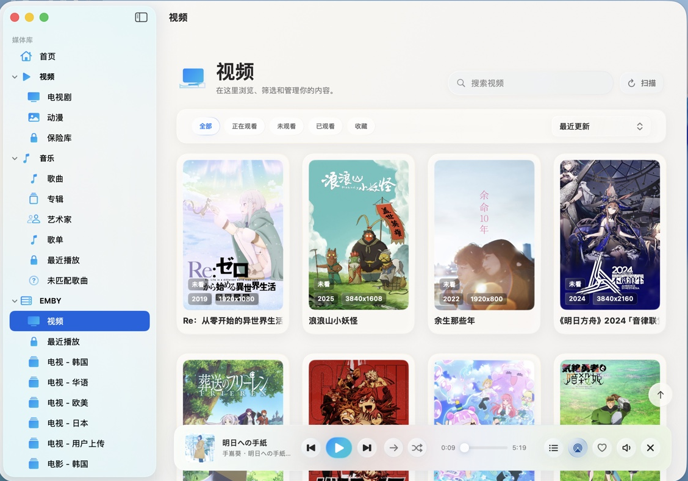
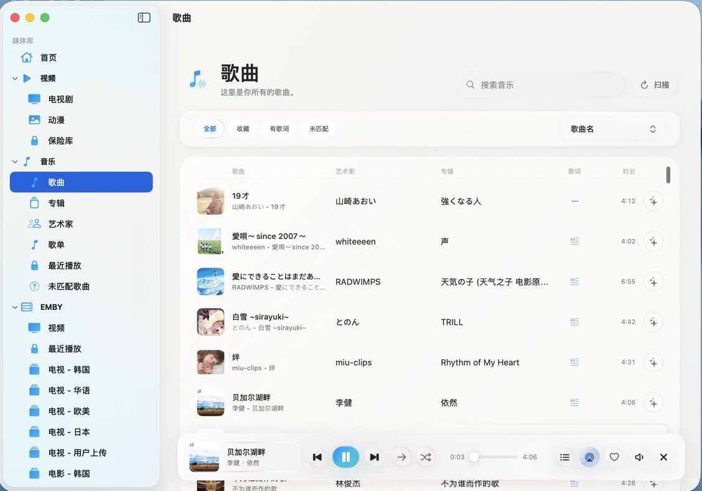
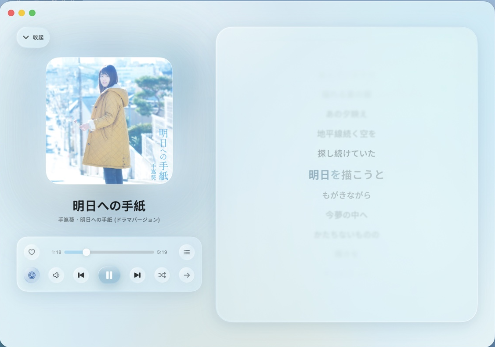
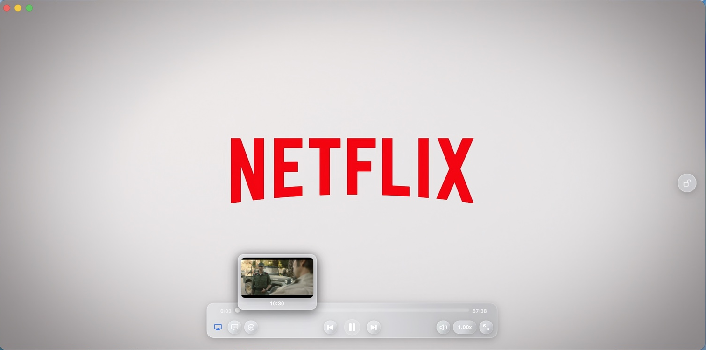
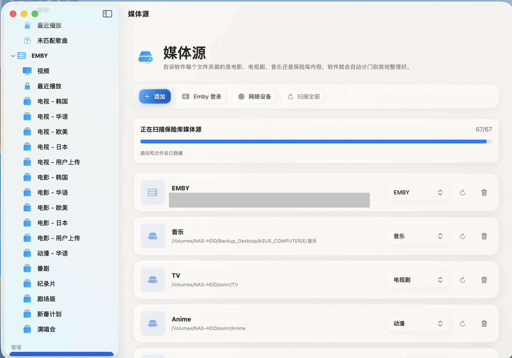
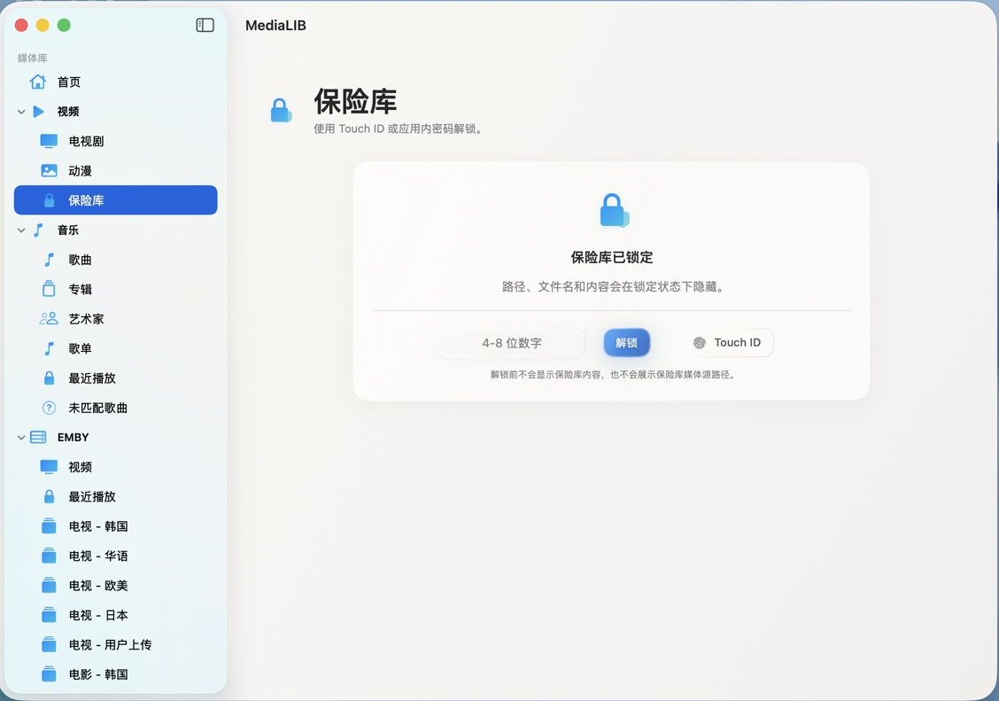
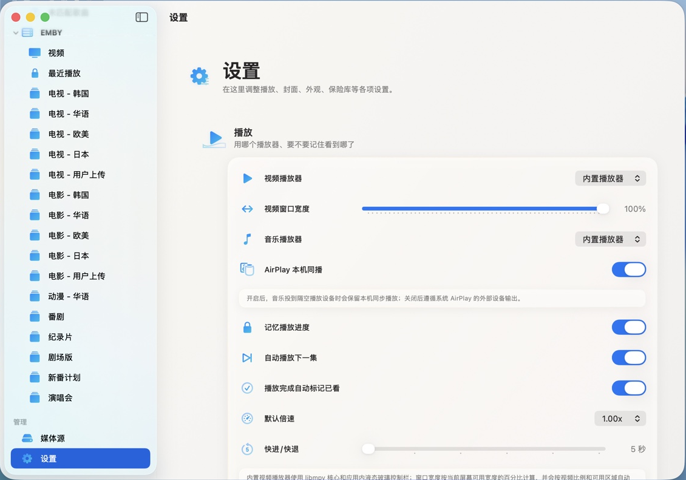
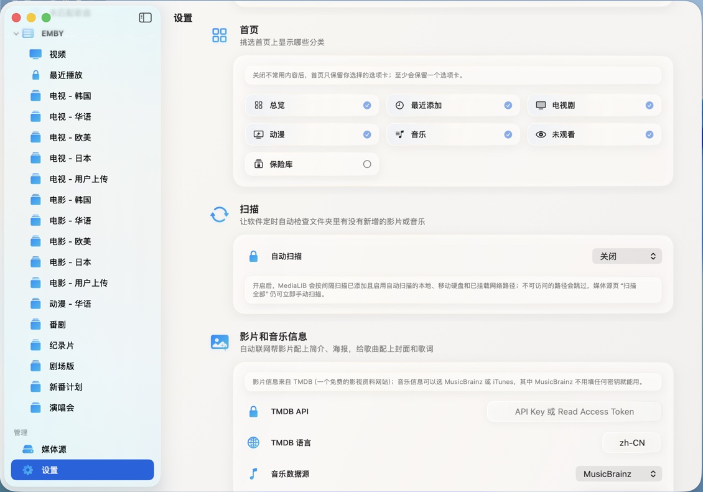

# MediaLIB

> 一款面向 macOS 的原生家庭影音媒体库：把本地硬盘、移动硬盘、NAS、SMB/FTP 挂载目录和 Emby 服务器里的视频与音乐整理到一个轻量、漂亮、可播放的媒体中心里。

MediaLIB 不是一个网页壳，也不是单纯的播放器。它是使用 **SwiftUI + AppKit + SQLite + libmpv + AVFoundation** 构建的 macOS 原生应用，目标是在本地优先、隐私友好、离线可用的前提下，提供接近系统级体验的媒体库管理、视频播放、音乐播放、元数据补全能力。



## 亮点

- **macOS 原生体验**  
  采用 SwiftUI 与 AppKit 混合实现，保留系统窗口、红黄绿按钮、菜单栏、媒体键、AirPlay 入口和 macOS 风格交互。

- **视频与音乐并列管理**  
  左侧栏把视频和音乐作为同级一级媒体库，支持电影、电视剧、动漫、纪录片、综艺、歌曲、专辑、艺术家、歌单等入口。

- **本地/NAS/Emby 一体化**  
  支持本地目录、移动硬盘、已挂载 NAS、SMB/FTP 网络设备目录，以及 Emby 登录同步。分类与重分类只写入 MediaLIB 内部索引，不移动用户文件。

- **内置视频播放器**  
  视频播放通过随 App 分发的 `libmpv` render API 嵌入应用内窗口，支持常见视频格式、字幕/音轨菜单、播放进度、快捷键和系统媒体控制。

- **原生音乐播放**  
  音乐播放基于 AVFoundation，支持底部迷你播放器、展开式沉浸播放器、播放队列、歌词、随机/循环、音量、进度拖动和 AirPlay 本机同播。

- **元数据与封面补全**  
  支持 TMDB、MusicBrainz、iTunes Search 等数据源；可读取音频标题、艺术家、专辑、年份、内嵌封面和歌词；MKV 等格式可通过 ffmpeg 兜底截帧。

- **保险库隐私保护**  
  支持 Touch ID 或 4–8 位数字密码解锁。锁定状态下隐藏保险库路径、文件名、扫描中的文件名和改密入口。

- **液态玻璃风格 UI**  
  普通页面使用白色玻璃卡片、浅色环境光、柔和描边和统一控件；音乐展开页使用专辑色沉浸背景。

## 截图

| 视频媒体库 | 音乐歌曲列表 |
| --- | --- |
|  |  |

| 沉浸音乐播放器 | 内置视频播放器 |
| --- | --- |
|  |  |

| 媒体源管理 | 保险库 |
| --- | --- |
|  |  |

| 播放设置 | 其他设置 |
| --- | --- |
|  |  |

## 当前功能

### 媒体源与扫描

- 添加、删除、持久化媒体源。
- 支持本地目录、移动硬盘、NAS 挂载目录、SMB/FTP 挂载目录和 Emby 服务器。
- 支持自动识别、电影、电视剧、动漫、纪录片、综艺、音乐、其他、保险库等分类。
- 本地/NAS 递归扫描，自动识别源可同时识别视频和音频。
- 支持自动扫描，定期发现新增媒体。
- 不移动、不改名、不复制用户媒体文件。

### 视频库

- 电影、电视剧、动漫、纪录片、综艺、其他、收藏、未观看、已观看、正在观看等入口。
- 电视剧按系列聚合，支持 `S01E01`、中文“第 x 季 第 x 集”、`EP01` 等常见命名。
- 海报墙按真实比例展示竖版海报和横版视频帧。
- 支持本地 `.nfo`、`poster/cover/folder`、`fanart/backdrop/background` 优先。
- 缺失海报时可抽取视频帧或绘制默认封面。
- 海报右键支持重分类、收藏、评分、标记已看/未看、删除播放记录。

### 音乐库

- 支持歌曲、专辑、艺术家、歌单、最近播放、未匹配歌曲。
- 歌单持久保存，只记录 MediaLIB 内部媒体索引，不改动原音乐文件。
- 支持音频标签读取：标题、艺术家、专辑、曲目号、年份、时长、内嵌封面、内嵌歌词。
- 音乐封面优先级：内嵌封面 > 联网补全 > 默认图标。
- 支持同步歌词、底部迷你播放器、展开播放器和队列弹层。

### 播放器

- 视频：`libmpv` 内嵌播放窗口，支持字幕、音轨、快捷键、进度保存和外部播放器入口。
- 音乐：AVFoundation 音频后端，支持播放队列、随机、循环、音量、seek、系统媒体键。
- AirPlay：通过原生 route picker 触发。

### 元数据与标签

- 视频元数据：TMDB 搜索与补全。
- 音乐元数据：MusicBrainz / iTunes Search。（默认只更新 MediaLIB 索引；用户显式开启“写入文件”后才尝试写回音频标签）。
- 写回使用临时文件校验后替换，远程资源、不可写路径和不支持格式会逐条跳过。

### 隐私与安全

- 保险库支持 Touch ID / 数字密码。
- 保险库锁定时隐藏路径、文件名、扫描中文件名和改密入口。
- Emby token 保存到系统钥匙串。
- 分类和重分类只修改内部 SQLite 索引。

## 技术栈

- **UI**：SwiftUI / AppKit
- **视频播放**：libmpv render API + 应用内 `NSOpenGLView`
- **音乐播放**：AVFoundation / AVPlayer
- **数据库**：SQLite3
- **系统能力**：AirPlay、MediaPlayer、LocalAuthentication、Keychain、macOS Material
- **元数据**：TMDB、MusicBrainz、iTunes Search
- **封面兜底**：AVFoundation 截帧，必要时 ffmpeg
- **交付**：SwiftPM + 手工 `.app` Bundle + `hdiutil` DMG

## 构建

确保已安装 Xcode，然后在项目根目录执行：

```bash
env DEVELOPER_DIR=/Applications/Xcode.app/Contents/Developer swift build
```

运行轻量检查：

```bash
env DEVELOPER_DIR=/Applications/Xcode.app/Contents/Developer swift run MediaLibChecks
```

打包 DMG：

```bash
scripts/package_dmg.sh
```

输出位置：

```text
dist/MediaLIB.app
dist/MediaLib.dmg
```

未签名版本首次打开时，可能需要右键 App 并选择“打开”。

## 项目结构

```text
Sources/MediaLib/App              应用入口、全局状态、主导航、播放器覆盖层
Sources/MediaLib/Views            SwiftUI 页面、卡片、列表、播放器 UI、玻璃材质
Sources/MediaLibCore/Models       媒体条目、媒体源、设置等模型
Sources/MediaLibCore/Database     SQLite 管理器与仓库
Sources/MediaLibCore/Services     扫描、解析、截图、元数据、Emby、文件访问
Sources/MediaLibChecks            轻量阶段验收程序
scripts                           图标生成与 DMG 打包脚本
```

## 开发状态

MediaLIB 仍在持续开发中。

## 免责声明

MediaLIB 用于管理用户自己的本地、NAS 或授权服务器媒体内容。请确保你拥有对应媒体文件、海报、封面和元数据的使用权限。

## License
GPL-3.0 license

