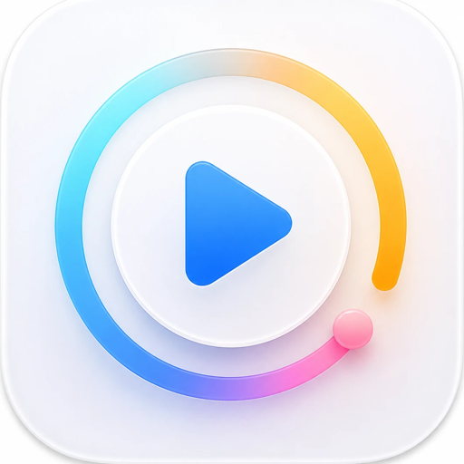
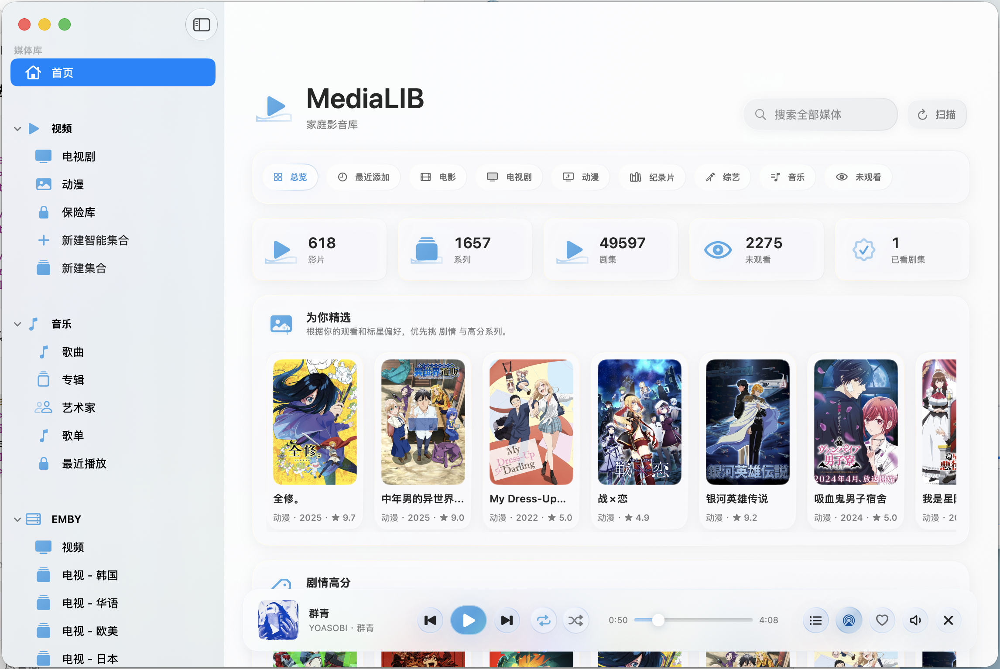
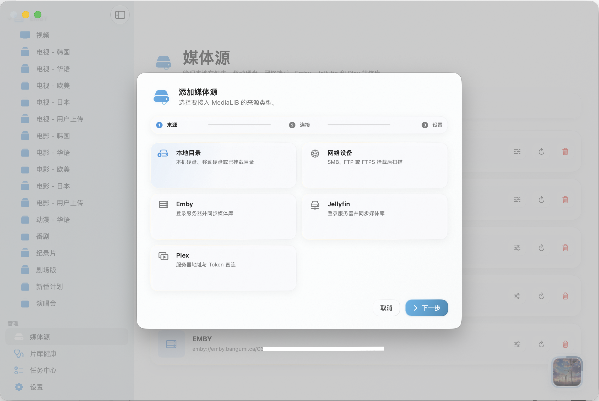
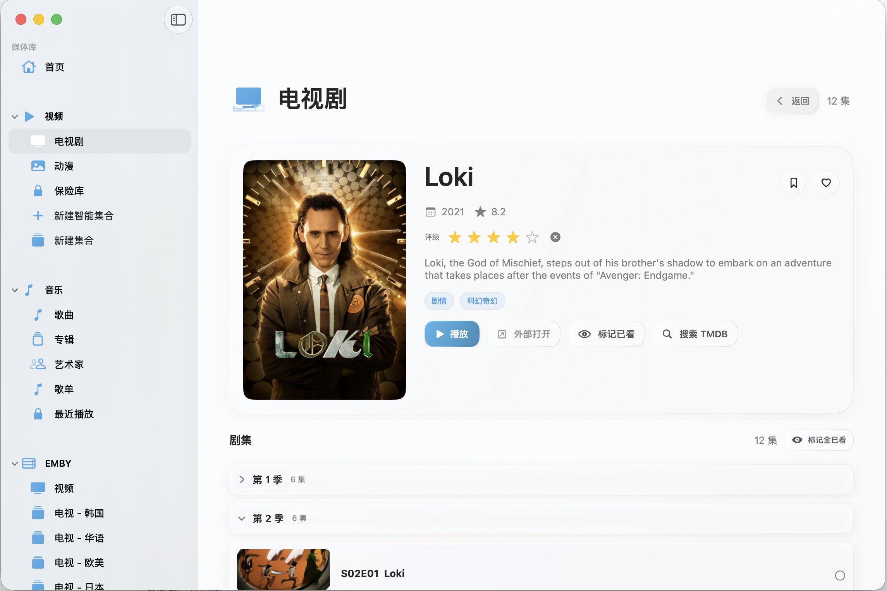
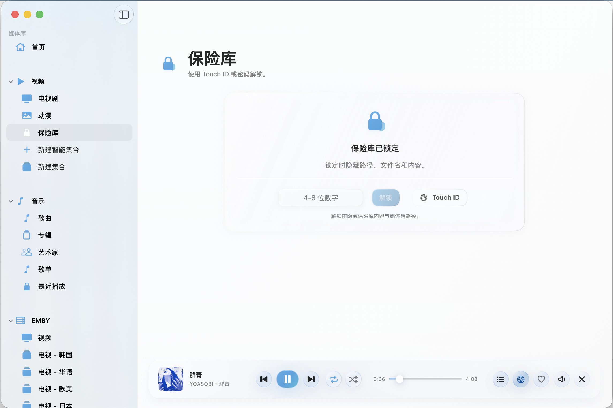
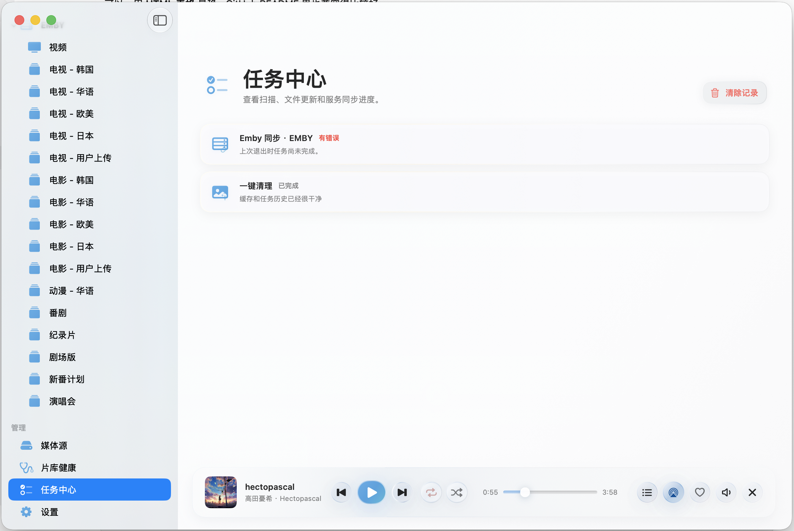

<h1>
  
  MediaLIB
</h1>

<strong>一个干净、自然、适合 macOS 的本地影音库。</strong>

  
  
  

<a href="https://ifdian.net/a/0521zn">喜欢的话可以赞助！</a>

MediaLIB 可以把散落在本地硬盘、移动硬盘、NAS、SMB/FTP 网络目录，以及 Emby、Jellyfin、Plex 里的电影、剧集、动漫、纪录片、综艺和音乐整理到一起。你可以在一个统一的界面里浏览、搜索、收藏、继续观看和直接播放。

它不会替你接管文件夹，也不会擅自移动或修改你的媒体文件。MediaLIB 更像是一个漂亮的“媒体索引中心”：你的文件继续留在原来的位置，分类、封面、播放记录、收藏、歌单、离线缓存和元数据修正都保存在 App 自己的本机数据里。

  

## 适合谁

- 影音文件分散在 Mac、移动硬盘、NAS 或家庭服务器里，平时靠 Finder 一层层翻。
- 电影、电视剧、动漫和音乐都想放在一个 App 里统一浏览。
- 已经在用 Emby、Jellyfin 或 Plex，但本地文件也很多。
- 喜欢简洁、安静、偏 macOS 原生风格的媒体库。
- 有一些私密目录，希望锁起来后不显示路径、文件名和播放痕迹。

## 主要功能

### 统一管理你的影音内容

MediaLIB 支持接入本地目录、网络设备、Emby、Jellyfin 和 Plex。添加媒体源时，只需要选择来源、完成连接，再确认分类和扫描方式即可。

  

本地目录和网络挂载目录可以归类为电影、电视剧、动漫、纪录片、综艺、音乐、其他或保险库；不确定时也可以使用自动识别。远程媒体服务器会作为独立入口显示，不会和本地视频、音乐混在一起。

### 电影、剧集和动漫

MediaLIB 会递归扫描目录，识别常见视频文件，并尽量从文件名和文件夹结构里判断内容类型。剧集会按系列聚合，按季和集数排序，支持 `S01E01`、`第01季 第02集`、`EP01` 等常见命名方式。

  

你可以给条目标记喜欢、想看、已观看、未观看、正在观看，也可以添加 1 到 5 星个人评级。MediaLIB 支持按标题、年份、评分、评级、最近添加、播放次数等方式浏览。

对于想自己整理的内容，可以创建手动集合；如果想让 App 自动筛选，也可以使用智能集合，比如按类型、观看状态、年份、评分、来源等规则生成片单，并把常用集合发布到首页。

  

### 音乐库和歌单

音乐是和视频并列的一套媒体库。MediaLIB 会读取音频标签，尽量识别标题、艺术家、专辑、曲目号、年份、时长、内嵌封面和歌词。

  

你可以按歌曲、专辑、艺术家、歌单和最近播放浏览。收藏歌曲会出现在置顶收藏歌单里，也可以创建自己的歌单，或把当前播放队列保存成歌单。歌单只记录 MediaLIB 内部索引和顺序，不会移动、复制或重命名音乐文件。

### 更沉浸的音乐播放

音乐播放器有底部迷你播放器和展开页两种状态。双击歌曲后会先出现底部迷你播放器，点击曲目信息后可以展开完整播放界面。展开页会从专辑封面取色，展示封面、控制栏、队列和歌词卡片。

  

歌词会优先使用音频内嵌歌词或同名 `.lrc` / `.txt` 文件。带时间戳的 LRC 可以自动滚动；增强 LRC 支持逐字或分词高亮。没有逐字时间戳时，MediaLIB 会根据歌词节奏估算行内进度，让歌词跟随播放更自然。

### 内置视频播放器

视频可以使用内置播放器，也可以按需改用系统播放器。内置播放器支持常见视频容器、字幕和音轨切换、外挂字幕、倍速、音量、全屏、窗口置顶、恢复播放、截图、章节、书签、A-B 循环、跳过片头片尾等常用能力。

  

对于远程视频，MediaLIB 也支持播放清晰度选择和本地缓存，适合网络不稳定时提前准备，或者临时离线观看。

### 保险库

保险库适合放私密内容。第一次进入时可以设置 4 到 8 位数字密码，之后可用 Touch ID 或密码解锁。

  

锁定后，MediaLIB 不会显示保险库内容、媒体源路径、扫描中的私密文件名，也不会在首页、继续观看、已观看、喜欢或想看里暴露保险库条目。解锁后，保险库内容可以正常浏览、播放、收藏、标记和清除播放记录。

### 片库健康和任务中心

片库健康可以检查媒体源离线、本地路径失效、远程播放路径缺失、疑似重复、缺少封面或年份等问题。所有清理动作都会要求确认，并且只会移除 MediaLIB 内部索引，不会删除你的原始媒体文件。

  

任务中心会记录扫描、增量扫描、远程同步、封面预热、元数据补充、视频缓存、章节图和一键清理等后台任务。失败任务在可以重建目标时会显示重试按钮。

## 快速开始

1. 打开 `MediaLIB.app`。
2. 进入“媒体源”，点击“添加媒体源…”。
3. 选择本地目录、网络设备、Emby、Jellyfin 或 Plex。
4. 本地或网络目录选择分类；不确定时使用“自动识别”。
5. 点击“扫描全部”，或扫描单个媒体源。
6. 扫描完成后，在左侧栏进入“首页”“视频”或“音乐”浏览。
7. 如需联网补充信息，在“设置 > 元数据与匹配”里配置对应数据源。

首次使用时，建议先添加一个较小的目录试扫，确认分类和封面效果符合预期后，再添加完整媒体库。

## 安装

如果你拿到的是 `MediaLib.dmg`：

1. 打开 DMG。
2. 将 `MediaLIB.app` 拖到“应用程序”。
3. 首次打开未签名版本时，macOS 可能会拦截。右键 `MediaLIB.app`，选择“打开”，再确认一次即可。

运行要求：

- macOS 13 Ventura 或更高版本。
- 本地扫描和播放不需要账号。
- TMDB、音乐元数据、远程服务器、字幕下载、Trakt、Last.fm 等功能需要网络和对应服务的账号或 API Key。

## 数据安全

MediaLIB 的基本原则是：不擅自改动你的媒体文件。

- 扫描只建立索引。
- 重分类只修改 MediaLIB 内部分类。
- 喜欢、想看、评级、播放记录和歌单都保存在本机索引里。
- 清理失效索引不会删除原始文件。
- 删除离线缓存只删除 MediaLIB 自己生成的缓存副本。
- 保险库锁定时会隐藏路径、文件名和内容。
- 数据库备份和恢复只处理 MediaLIB 内部数据，不复制或替换媒体源里的文件。

## 项目状态

MediaLIB 仍在持续打磨中。当前重点是让媒体库、播放器、远程同步、音乐体验、离线缓存和界面性能变得更稳定、更顺手。

使用过程中遇到问题，欢迎通过 Issue 反馈。最好附上页面、操作步骤、截图和日志信息，这样更容易定位问题。

## 许可

当前仓库供个人学习与使用。随 App 使用或打包的 libmpv、ffmpeg 等第三方组件遵循各自的开源许可；如果你计划再分发或商用，请先确认相关许可要求。
