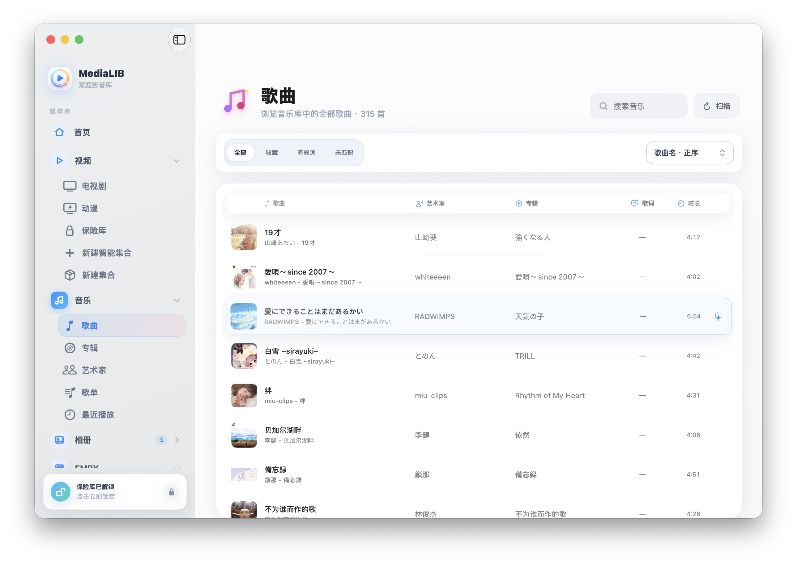
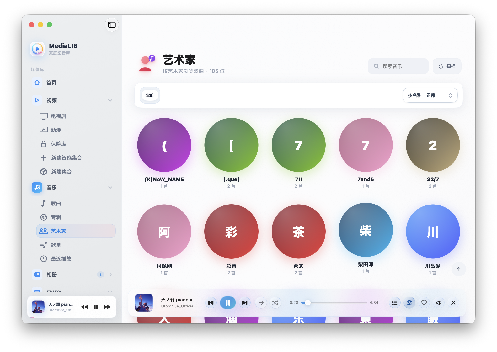
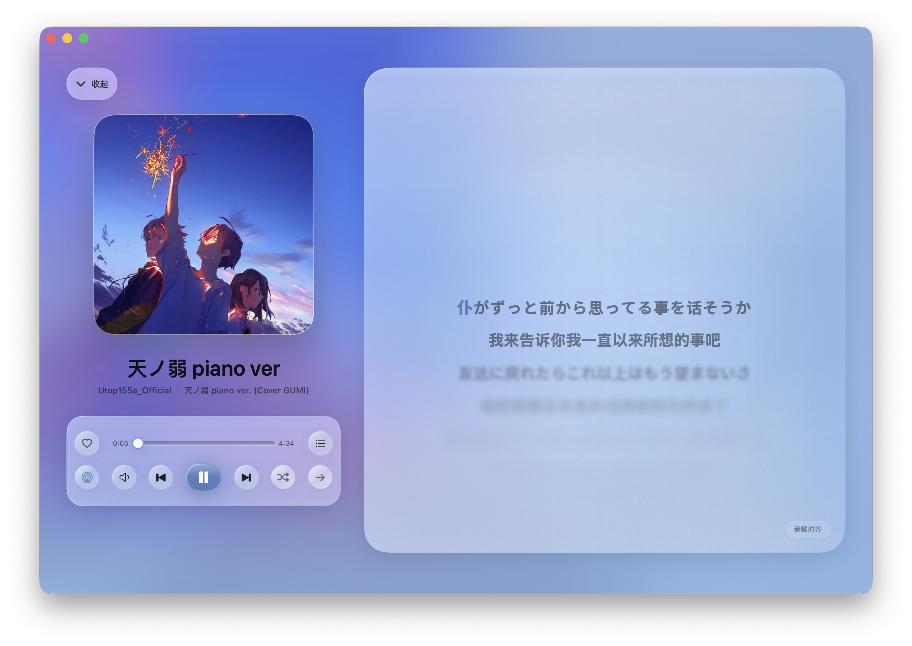
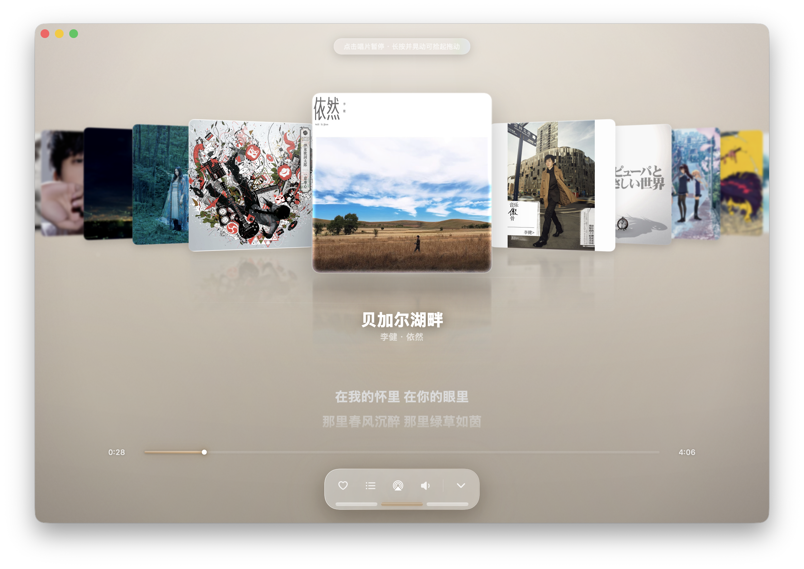
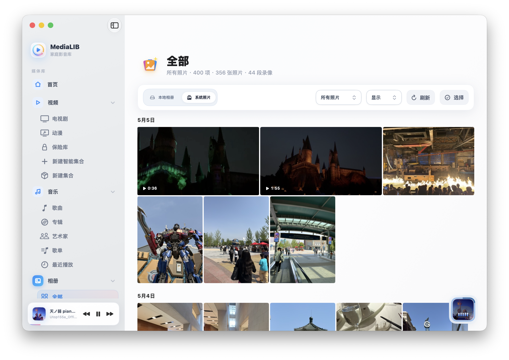
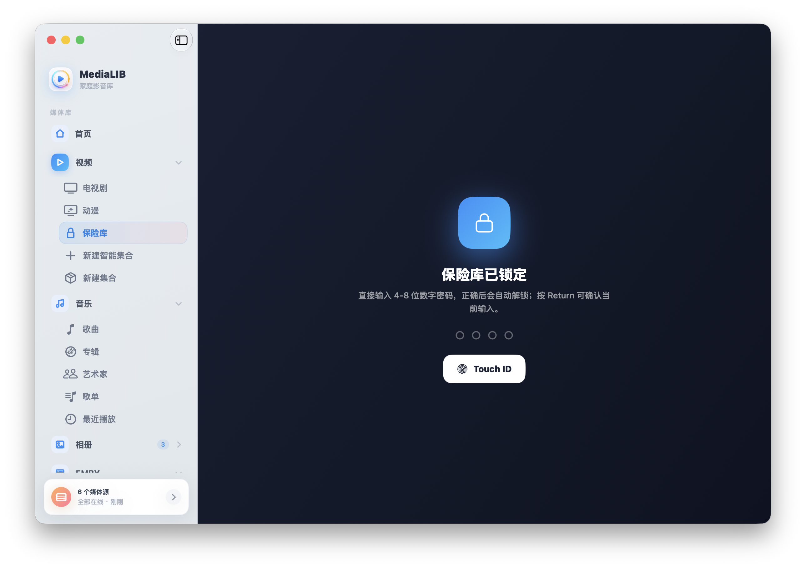
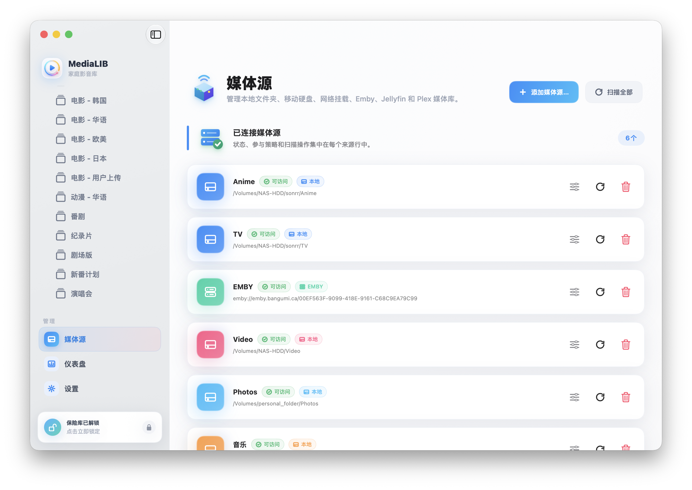
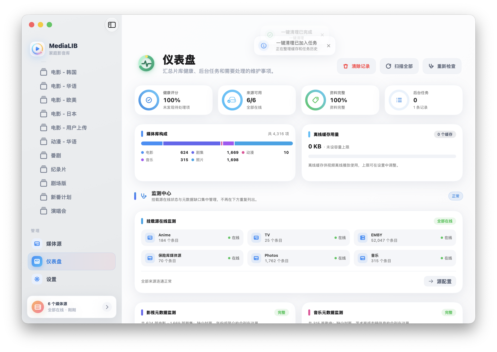
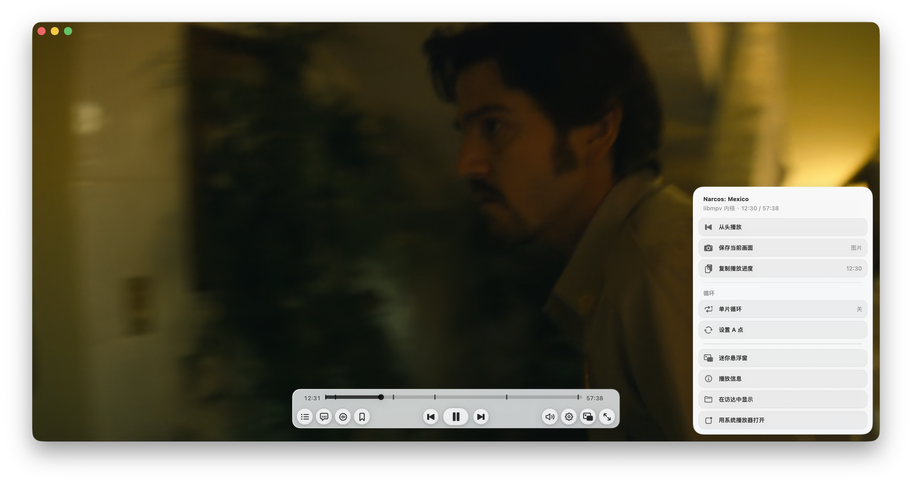

<div align="center">

**简体中文** ·
[English](README.en.md) ·
[日本語](README.ja.md)

# MediaLIB

### 你的电影、剧集、动漫、音乐和照片，终于住进了同一个家。

一款 macOS 原生的家庭影音库。把散落在本地硬盘、移动硬盘、NAS，以及 Emby、Jellyfin、Plex 里的内容，收进一个清爽、好看、好用的应用里——统一浏览、统一搜索、统一播放。

<br>


<br>


</div>

<br>

## 先说最重要的一件事

> **MediaLIB 管理的是「索引」和「缓存」，不是你的文件本身。**

扫描、分类、喜欢、想看、评分、播放记录、歌单、封面和元数据修正，默认都只保存在 MediaLIB 自己的数据里。它**不会移动、不会删除、也不会改名**你的任何一个媒体文件。

唯一的例外，是你在音乐标签工作台里**亲手打开「写入文件」**——只有那时，它才会去动音频文件的标签。除此之外，你的原始收藏永远保持原样。

<br>

## 一个首页，看见你的全部

打开就是家。首页会根据你的媒体库，为你精选一份今日片单，把「继续观看」「继续听」「最近添加」「今日推荐音乐」和实时的照片墙铺在一起。想找什么，右上角搜索一下——电影、剧集、动漫、音乐会各自穿透查找，哪一类先有结果就先出现，不用干等。

<table>
  <tr>
    <td width="50%"></td>
    <td width="50%"></td>
  </tr>
</table>

<br>

## 影视与剧集，整理得明明白白

电影、电视剧、动漫、纪录片、综艺，各归各位。剧集会自动按系列、季、集聚合，扫描时已经整理好的部分会先出现，剩下的再慢慢补齐。

- **看得舒服** — 海报墙均匀铺排，鼠标划过就浮起，评分角标一眼可见。
- **管得顺手** — 喜欢、想看、已看 / 未看 / 在看、五星评分，右键即可标记。
- **归得清楚** — 手动集合、智能集合，还能把喜欢的合集发布到首页。
- **认得出来** — 通过 TMDB 补齐海报、简介、演职人员、剧照、相似推荐和人物档案。
<table>
  <tr>
    <td width="50%"></td>
    <td width="50%"></td>
  </tr>
</table>
<br>

## 音乐，值得被认真对待

歌曲、专辑、艺术家、歌单、最近播放，一应俱全。扫描会读取音频标签，尽力还原标题、艺术家、专辑、年份、封面、歌词和响度信息。队列、下一首、拖动排序、随机播放、循环、收藏，都在手边。

<table>
  <tr>
    <td width="50%"></td>
    <td width="50%"></td>
  </tr>
</table>

### 两种沉浸播放，随心切换

不只是能听，更是好听、好看。展开播放页提供两款各具气质的主题：

<table>
  <tr>
    <td width="50%">
      <br>
      <b>琉璃</b> — 专辑取色的沉浸玻璃背景，逐字点亮的歌词，安静而专注。
    </td>
    <td width="50%">
      <br>
      <b>湖光</b> — 唱片墙式封面流，近大远小、湖面倒影，像在翻看一架黑胶。
    </td>
  </tr>
</table>

滚动长列表时，播放器会收成右下角一枚小小的封面，上面转着进度环；点一下，又是完整的展开页。

<br>

## 照片，本地与系统一起看

相册把本地录像、照片和 macOS「系统照片」放在同一个页面。系统照片通过 PhotoKit 实时读取，**不会复制进 MediaLIB**。支持按日期分组、连续切图、捏合缩放、双指平移，iCloud 原图需要下载时也会显示进度。



<br>

## 一把锁，守住私密内容

**保险库**用来存放不想被看到的内容。锁定时，它的路径、文件名、来源、数量都不会泄露，也不会出现在首页、已看、喜欢或人物作品里——就像它从不存在。首次进入引导设置 4–8 位 PIN，之后可用 Touch ID 一触解锁。



<br>

## 你的媒体，从哪来都行

在「媒体源」里，本地文件夹、移动硬盘、已挂载的 NAS，以及 Emby、Jellyfin、Plex 服务器，都能一处管理。远程服务器会显示为独立目录，不和本地内容混在一起；离线时也不会把文件误判成已删除。



<br>

## 心里有数的仪表盘

**仪表盘**把片库健康、后台任务和需要处理的事项汇成一屏：媒体源在不在线、有没有失效文件、封面和元数据齐不齐、离线缓存用了多少。一键清理，随手保持干净。



<br>

## 一台够用的播放器

内置视频播放器基于随应用分发的 **libmpv**，在原生窗口里渲染，红黄绿按钮和系统圆角都在：

| 播放 | 字幕与音轨 | 进阶 |
| :-- | :-- | :-- |
| 常见容器与 MKV | 内嵌 / 同目录外挂字幕 | 章节、书签、片头片尾标记 |
| 倍速、音量、全屏、置顶 | 多音轨切换 | A-B 循环、单片循环、自动下一集 |
| 截图、帧预览、剩余时间 | 在线字幕搜索下载 | 远程清晰度选择、离线缓存 |

不想用内置？在设置里可以随时切回系统默认播放器。


<br>

## 开始使用

**系统要求**：macOS 13 Ventura 或更高版本。本地扫描和播放**无需账号**。TMDB 刮削、音乐元数据、远程服务器、字幕下载等联网功能，需要对应服务的账号或 API Key。

拿到 `MediaLib.dmg` 后：

1. 打开 DMG；
2. 把 `MediaLIB.app` 拖进「应用程序」；
3. 首次打开本地构建版本时 macOS 可能拦截，右键 App 选择「打开」，再确认一次即可。

<br>

## 从源码构建

```bash
brew install mpv ffmpeg
env DEVELOPER_DIR=/Applications/Xcode.app/Contents/Developer swift build
env DEVELOPER_DIR=/Applications/Xcode.app/Contents/Developer swift run MediaLibChecks
scripts/package_dmg.sh
```

产物为 `dist/MediaLIB.app` 与 `dist/MediaLib.dmg`。

<br>

## 数据安全原则

<details>
<summary><b>展开查看 MediaLIB 对你数据的七条承诺</b></summary>

<br>

- 扫描只建立或更新内部索引，不改动媒体文件。
- 重分类只修改 MediaLIB 内部分类。
- 喜欢、想看、评级、播放记录、集合、歌单都保存在本机索引。
- 清理失效索引需要确认，只删索引、不删文件。
- 离线缓存只管理 MediaLIB 自己生成的缓存副本。
- 数据库备份与恢复只替换内部数据，不触碰媒体源文件。
- 保险库锁定时不泄露任何私密路径、名称或数量。

</details>

<br>

## 文档

| 文档 | 内容 |
| :-- | :-- |
| [用户使用说明](doc/用户使用说明.md) | 面向普通用户的完整功能说明 |
| [开发说明](doc/开发说明.md) | 架构、约束与验证 |
| [设计系统标准](doc/MediaLIB_设计系统标准.md) | 页面与音乐展开页的视觉规范 |
| [ROADMAP](doc/ROADMAP.md) | 后续计划 |
| [CHANGELOG](doc/CHANGELOG.md) | 历史变更记录 |

<br>

## 许可

本仓库当前供个人学习与使用。随应用分发或打包的 libmpv、ffmpeg 等第三方组件遵循各自的开源许可；再分发或商用前，请先确认相关许可要求。

<br>

<div align="center">
<sub>为家庭影音库而生 · 用 SwiftUI 与 ❤️ 打磨</sub>
</div>
